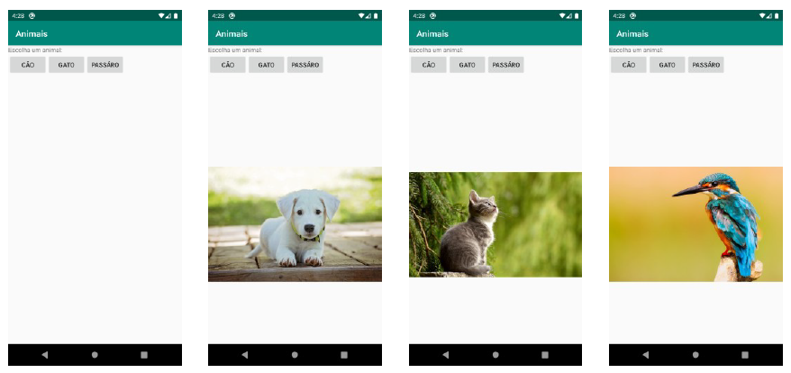
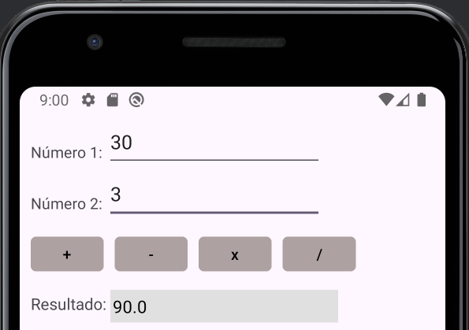

# Apps

Este repositório contém os projetos desenvolvidos para fins de aprendizado.

## 1. Animais

O projeto **Animais** permite ao usuário escolher um animal por meio de botões. Ao selecionar um animal, a imagem correspondente é exibida na tela.

## 2. Calculadora

O projeto **Calculadora** é uma calculadora básica que realiza as quatro operações matemáticas (adição, subtração, multiplicação e divisão) entre dois números informados pelo usuário.

