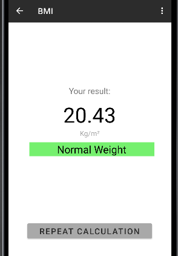

# Apps

Este repositório contém os projetos desenvolvidos para fins de aprendizado.

## 1. Animais

O projeto **Animais** permite ao usuário escolher um animal por meio de botões. Ao selecionar um animal, a imagem correspondente é exibida na tela.

## 2. Calculadora Básica

O projeto **Calculadora** é uma calculadora básica que realiza as quatro operações matemáticas (adição, subtração, multiplicação e divisão) entre dois números informados pelo usuário.

## 3. Calculadora Melhorada

O projeto **Calculadora Melhorada** é uma calculadora como a do celular que realiza operações matemáticas (adição, subtração, multiplicação, divisão, inverte sinais e porcentagem) entre dois números informados pelo usuário, sendo exibidos na tela a expressão e o resultado. O estilo foi baseado na calculadora do iPhone.

## 4. Ringer

O projeto **Ringer** permite que o app leia o modo de notificação do celular (normal ou silencioso) e também permite que esse estado seja alterado apertando um botão.

## 5. Lifecycle

O projeto **Lifecycle** permite que a visualização dos ciclos de vida do app em LogCat.

## 6. Conversor de Temperatura

O projeto **Conversor de Temperatura** permite que o usuário insira um valor e escolha a conversão para Celsius ou Fahrenheit.

## 7. BMI

O projeto **BMI** é uma calculadora de Índice de Massa Corporal (Body Mass Index) que possui três telas (a primeira onde os valores de altura e peso são informados, a segunda onde o valor do IMC e a categoria aparecem e a terceira com um texto de ajuda). O app também possui um menu para acesso da tela de ajuda e para envio de SMS.

  

## 8. Conversor de Moeda

O projeto **Conversor de Moeda** permite que o usuário insira um valor e escolha a moeda de conversão para Euro ou Dólar.

## 9. Lista

O projeto **Lista** é uma lista de flores e animais (fauna e flora) que quando selecionados exibe a informação relacionada.
  

## 10. Profile

O projeto **Profile** é um aplicativo para salvar as informações de cadastro de usuário temporariamente no app quando o usuário fechar o aplicativo e abri-lo novamente.

## 10. UserBD

O projeto **UserBD** é uma aplicação que utiliza a biblioteca Room para realizar o gerenciamento e armazenado dos dados de usuários, com funções de adicionar, procurar todos, procurar por nome e email e remover um usuário.

